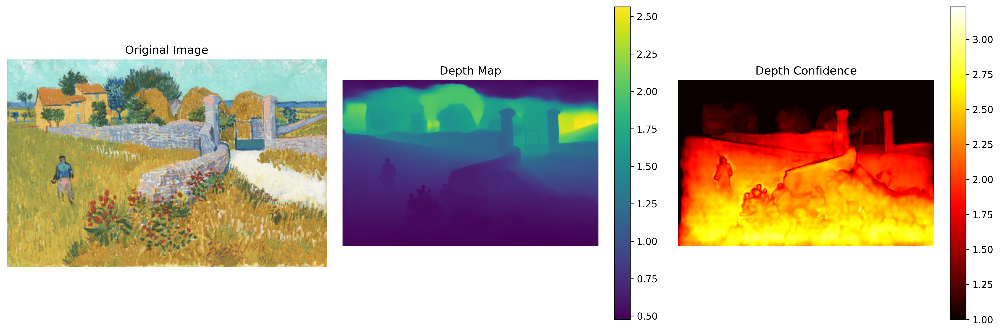
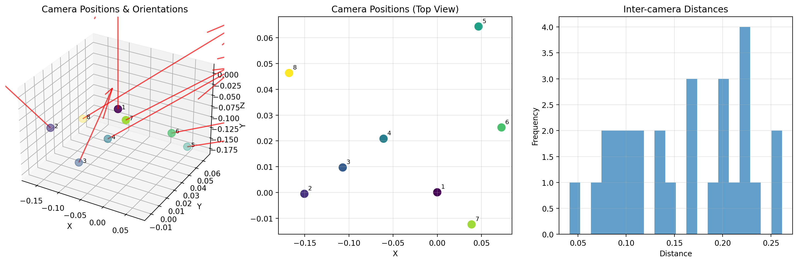
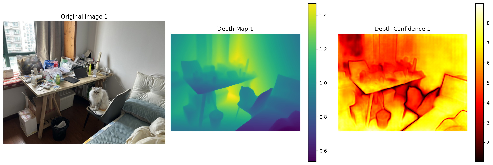

# VGGT 单张及多张图像推断运行指南

## 环境设置

```bash
# 导出环境
conda env export > vggt_environment.yml
```
```bash
# 在新的环境中安装环境
conda env create -f vggt_environment.yml
```


## 使用单张图像推断脚本

### 1. 准备模型权重

```bash
# 激活环境
conda activate vggt

# 方法A：使用wget下载（使用xget）
mkdir -p checkpoints

wget https://xget.xi-xu.me/hf/facebook/VGGT-1B/resolve/main/model.pt -O checkpoints/model.pt
```

### 2. 准备图像

将您要测试的图像放在项目目录中，或使用项目提供的示例图像：
- `examples/single_oil_painting/images/model_was_never_trained_on_single_image_or_oil_painting.png`
- `examples/single_cartoon/images/model_was_never_trained_on_single_image_or_cartoon.jpg`

### 3. 运行推断

```bash
conda activate vggt
python single_image_inference.py
```

### 4. 查看结果

运行成功后，会在`output/`目录下生成：
- `depth_visualization.png` - 深度图可视化
- `point_cloud.ply` - 3D点云文件（可在Blender等软件中查看）
- `camera_params.npz` - 相机参数

### 单张图像推断示例结果



*从左到右依次为：原始图像、深度图（彩色编码，蓝色表示近距离，黄色表示远距离）、深度置信度图（数值越高表示置信度越高，VGGT中置信度值通常大于1）*


## 使用多张图像推断脚本

### 1. 准备图像

将您要测试的图像放在项目目录中，或使用项目提供的示例图像：
- `examples/room/images`

### 2. 运行推断

```bash
python multi_image_reconstruction.py
```

### 3. 查看结果

运行成功后，会在`multi_output_time/`目录下生成：
- `multi_overview.png` - 多图像推断结果概览图
- `camera_analysis.png` - 多图像相机位姿分析图
- `combined_point_cloud.ply` - 合并点云文件（可在Blender等软件中查看）
- `camera_parameters.json` - 相机参数
- `reconstruction_data.npz` - 重建数据
- `image_XX_analysis.png` - 每张图像的详细分析图

### 多图像重建示例结果


*展示了8张中6张房间图像的原始图像、深度图和置信度图的综合对比*

### 相机位姿分析



*显示了推断得到的相机在3D空间中的位置分布、朝向以及相机间距统计*

### 单张图像详细分析



*展示了第一张图像的原始图像、深度图（viridis色彩映射）和深度置信度（hot色彩映射）的详细分析。注意：VGGT的置信度值范围通常在1-3之间，数值越高表示模型对该像素深度预测的信心越强*

---
